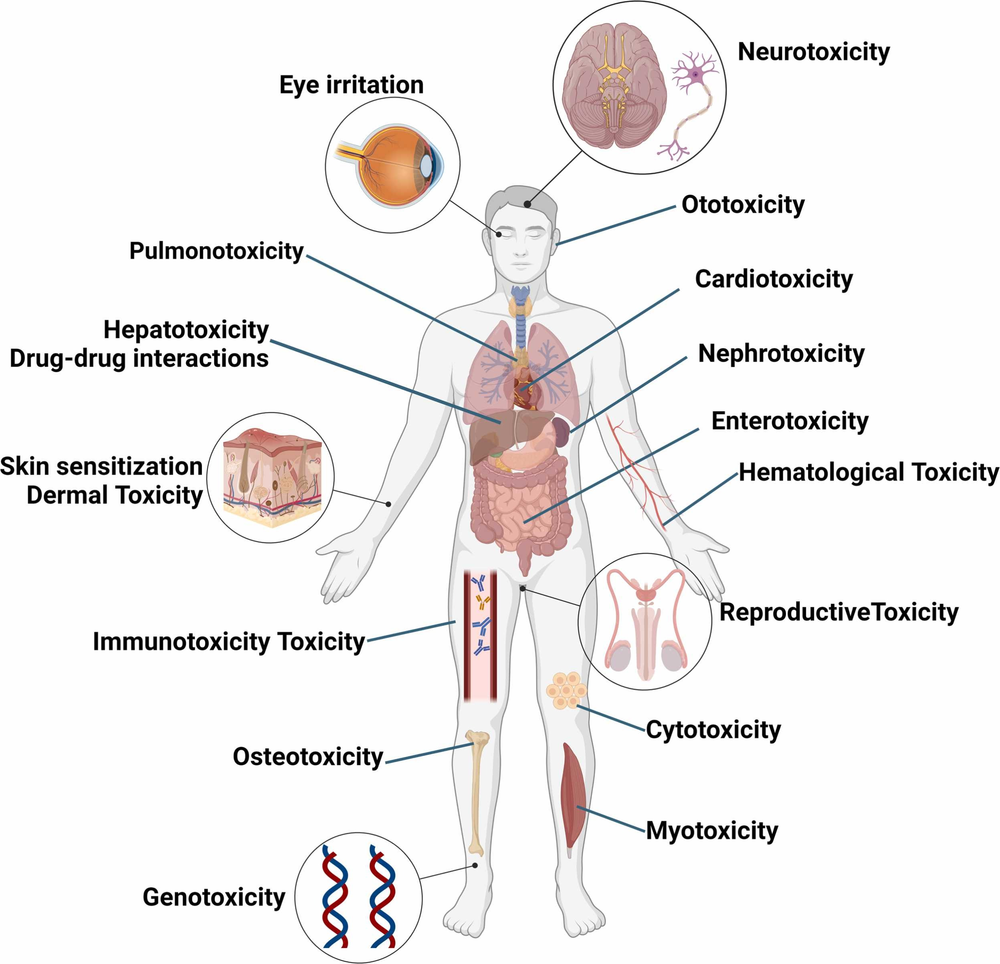
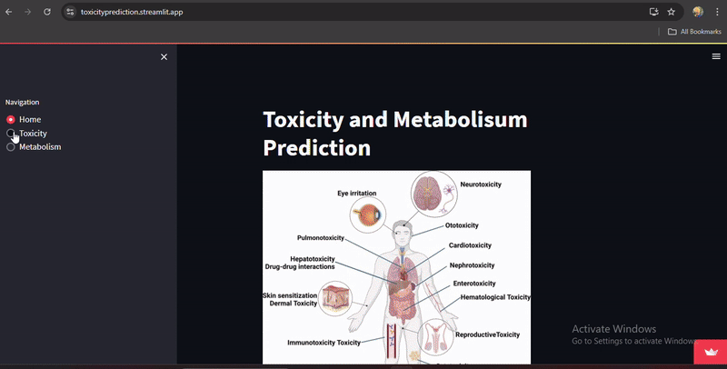

# Drug toxicity prediction

As a specialist in in silico drug-induced human toxicity modeling, I have developed predictive models focusing on hepatotoxicity, cardiotoxicity, carcinogenicity, and mutagenicity. These models leverage computational techniques to simulate and predict adverse drug reactions, enabling early-stage identification of potential toxicities during drug development. Also work with the metabolism of drug contaning CYP3A4,CYP2C9 and CYP2D6 target.

Through data-driven approaches such as machine learning, molecular modeling, and systems biology, I create highly accurate models to predict toxicity outcomes. These models are built on large-scale biological datasets, including chemical structure-activity relationships, gene expression profiles, and clinical toxicity data.

 

## Motivation
Predictive toxicity models play a critical role in modern drug discovery. With high rates of failure in clinical trials due to unforeseen toxic effects, these models allow pharmaceutical companies to identify compounds with potential safety issues earlier, saving time, resources, and improving the likelihood of success in later stages of development.

## Model Building
The models leverage machine learning, Deep learning, NLP, Graph Nural Networks(GNN) technique approaches to predict toxicity outcomes. Data is sourced from publicly available toxicity datasets, chemical structure libraries, and biological databases. Key features considered include chemical structure, ADMET profiles, gene expression data, and physicochemical properties.

## Feture Development
Future work will focus on expanding the toxicity prediction models to cover additional endpoints such as nephrotoxicity and immunotoxicity. We are also working on incorporating real-world clinical data to further improve the models' predictive accuracy. Collaboration with industry partners is welcome for model validation in real-world drug development scenarios.


## Installation
```bash
  Pip install requrement.txt
```
```bash
matplotlib
blinker==1.8.2
click==8.1.7
click-aliases==1.0.1
click-default-group==1.2.4
click-help-colors==0.9.4
colorama==0.4.6
commonmark==0.9.1
Flask==3.0.3
greenlet==3.0.3
itsdangerous==2.2.0
Jinja2==3.1.4
joblib==1.4.2
lightgbm==4.3.0
MarkupSafe==2.1.5
numpy==1.26.4
pandas==2.2.2
pillow==10.3.0
pytz==2024.1
rdkit==2023.3.3
rich==9.13.0
scikit-learn==1.2.2

```
## Deployment

To deploy this project on [Streamlit]([https://dashboard.render.com/](https://streamlit.io/))

```bash
  app.py
```


## Demo

Below is the domo for created application




## Live demo
Below is the link for live demo

[https://mobile-price-analysis.onrender.com](https://toxicityprediction.streamlit.app/)


## Dataset
The data for model training and validation comes from established toxicity databases such as ToxCast, PubChem, and ChEMBL. These databases provide detailed chemical structure information and toxicity profiles, which are used to build robust machine learning models. The data was preprocessed by normalizing chemical properties and performing feature engineering to enhance the predictive power of the models.
 [PubChem]([https://www.kaggle.com/](https://pubchem.ncbi.nlm.nih.gov/))

    
## Uses

To use the toxicity models, follow these steps:
1. Install the necessary dependencies (Python, scikit-learn, RDKit).
2. Load your compound dataset in .csv format.
3. Run the provided script, which will preprocess the data and generate toxicity predictions for hepatotoxicity, cardiotoxicity, carcinogenicity, and mutagenicity.
A sample script (toxicity_predictor.py) is included in the repository for testing purposes.


# Hi, I'm Ganesh! 👋


## 🚀 About Me
I am Completed post graduation in statistics with verious takenincal skills and 3+ year of experiance in data science domain.


## 🛠 Skills
R, spss, Python, Flask, ML, DL, NLP, MLops, streamlit, docker, GenrativeAI, Render, MySQL, PowerBI, Excel etc.


## Feedback

If you have any feedback, please reach out to us at dhanawadeganesh386@gmail.com


## 🔗 Links
[](https://github.com/Ganeshdhanawade/Data-Science-Portfolio)
[](https://www.linkedin.com/in/ganesh-dhanawade-47653b201/)


